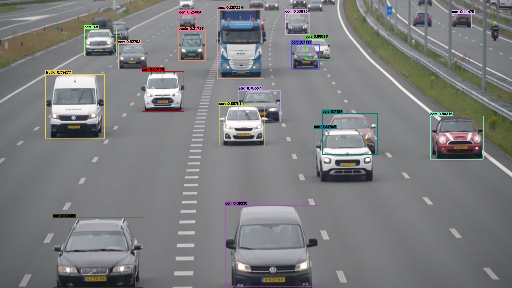
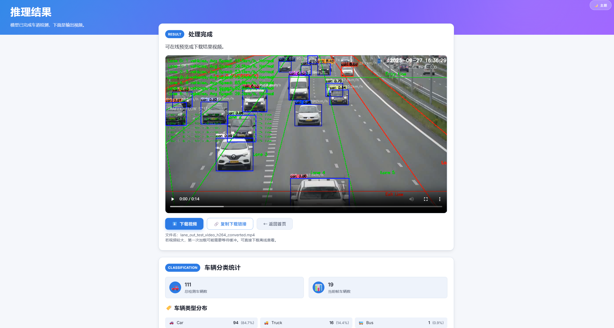

# 基于MindSpore的YOLOv12实现智能交通分析
## 项目产出要求

+ 基于MindSpore框架和套件，**迁移YOLOv12模型**，精度性能达到论文水平。
+ 基于YOLOv12模型，完成一个交通安全的案例应用：**检测紧急车道违规并识别阻碍紧急车辆的车辆**；**分析基于车道的交通流速和拥堵情况**，以确定交通状况；**对车辆进行计数并对类型进行分类**，以提供有关不同车辆类型的数据。
+ 完成以下功能模块的开发：
  + `LaneDetector`类：①**加载多边形数据**：从JSON文件中读取泳道区域并缩放它们以匹配视频分辨率。②**确定泳道位置**：使用其边界框检查检测到的车辆是否在车道内。③**跟踪车辆数量和速度**：计算车辆数量并计算每条车道的平均速度。
  + `LaneVehicleProcessor`类：①**集成YOLO和ByteTrack**：YOLO检测车辆，而 ByteTrack 跨帧跟踪它们。②**分析检测区域**：将检测到的车辆与预定义的车道区域进行比较。③**显示流量数据**：使用`OpenCV`和`Supervision`库在视频上叠加实时数据。
  + 流量管理：①**入口和出口区域**：跟踪车辆进出的车道。②**速度估计**：为车辆分配随机但真实的速度值。③**紧急车道警告**：检测应急车道上的车辆并发出警告。

## 模型迁移

项目基于MindSpore框架和Mindyolo项目复现了YOLOv12模型，使用与论文相同的参数，在COCO数据集下进行验证的结果如表1所示。

<p align="center">表1 YOLOv12验证结果</p>

|          | $AP_{50:95}^{val}(\%)$ | $AP_{75}^{val}(\%)$ | $AP_{95}^{val}(\%)$ | $AP_{samll}^{val}(\%)$ | $AP_{medium}^{val}(\%)$ | $AP_{large}^{val}(\%)$ |
|:--------:|:----------------------:|:-------------------:|:-------------------:|:----------------------:|:-----------------------:|:----------------------:|
| YOLOv12n |          39.6          |        55.6         |        43.0         |          19.3          |          43.9           |          57.4          |
| YOLOv12s |          47.0          |        64.2         |        50.7         |          29.1          |          51.9           |          64.5          |
| YOLOv12m |          51.9          |        69.6         |        54.3         |          35.5          |          57.0           |          68.2          |
| YOLOv12l |          53.4          |        71.0         |        58.0         |          35.7          |          58.9           |          70.1          |

使用YOLOv12s进行模型推理，结果如图1所示。



<p align="center">图1 YOLOv12s推理结果</p>

## 智能交通分析

项目使用`HTML+CSS+JavaScript`作为前端，Python的`flask`库作为后端进行web界面开发，前端界面主要包含两个：一个是上传视频及参数选择界面，如图2所示，另一个是检测结果界面，如图3，4所示。


<p align="center">图2 前端上传视频及参数选择界面</p>



<p align="center">图3 前端推理结果界面1</p>


<p align="center">图3 前端推理结果界面2</p>

## 快速开始

### 模型迁移

**1.数据集预处理及准备**

准备好COCO2017数据集，首先将其转换为YOLO格式，如图4所示；然后将数据集按照如图5所示的文件结构放置。

<div style="text-align: center;">

</div>
<p align="center">图4 YOLO数据集格式</p>

<div style="text-align: center;">

</div>
<p align="center">图5 数据集文件放置形式</p>

**2.环境准备**

使用单卡或多卡Ascend: 8*ascend-d910b，要求Python>=3.9，mindspore>=2.6 ，然后使用运行`pip install -r requirements.txt`安装相应的包即可。

**3.模型训练**

单卡：

```shell
python train.py --config ./configs/yolov12/yolov12-n.yaml 
```

多卡：

```shell
msrun --worker_num=8 --local_worker_num=8 --bind_core=True --log_dir=./yolov12_log python train.py --config ./configs/yolov12/yolov12-n.yaml --device_target Ascend --is_parallel True
```

**4.模型推理**

```shell
python predict.py --config ./configs/yolov12/yolov12-n.yaml --weight=/path_to_ckpt/WEIGHT.ckpt --image_path /path_to_image/IMAGE.jpg
```

**5.模型验证及测试**

单卡：

```shell
python test.py --config ./configs/yolov12/yolov12-n.yaml --weight /path_to_ckpt/WEIGHT.ckpt
```

多卡：

```shell
msrun --worker_num=8 --local_worker_num=8 --bind_core=True --log_dir=./yolov12_log python test.py --config ./configs/yolov12/yolov12-n.yaml --weight /path_to_ckpt/WEIGHT.ckpt --is_parallel True
```

### 使用智能交通分析页面

执行`python web.py`，上传视频、选择车道JSON文件、模型配置及权重即可。

### 可能出现的问题

+ 问题一：在进行模型验证时报错`ModuleNotFoundError: No module named 'pycocotools._mask'`

  解决方案：这个错误是由于安装`pycocotools`包时其缺少了`_mask`这个API导致的报错，需要手动解决。以下是基于Linux系统的解决方案：

​	(1)首先需要去github上下载COCOAPI，git指令为：

```shell
git clone https://github.com/cocodataset/cocoapi.git
```

​	(2)下载好之后需要进到PythonAPI文件夹，运行指令：

```shell
cd cocoapi/PythonAPI
```

​	(3)进入文件夹之后，执行以下两条指令：

```c++
python setup.py build_ext --inplace
python setup.py build_ext install
```

​	重新运行验证代码，就能够解决报错。

+ 问题二：在进行模型验证时报错`module 'numpy' has no attribute 'float'`

  解决方案：这是环境安装的`numpy`包太新导致的，新版本的`numpy`已经删除了`'float'`属性，需要使用旧版本的`numpy`，使用1.23.5版本的numpy即可解决这个错误，执行指令：

```shell
pip install -U numpy==1.23.5
```

+ 问题三：在前端推理界面时加载视频失败

  解决方案：这是由于浏览器和`OpenCV`对视频的编码格式不一致导致的，需要将推理后的视频转换为H.264编码格式浏览器才能正常加载视频，转换的工具项目使用的是`ffmpeg`，注意安装`ffmpeg`的指令应该使用`conda install ffmpeg`，使用`pip install ffmpeg`无法正常安装该包。